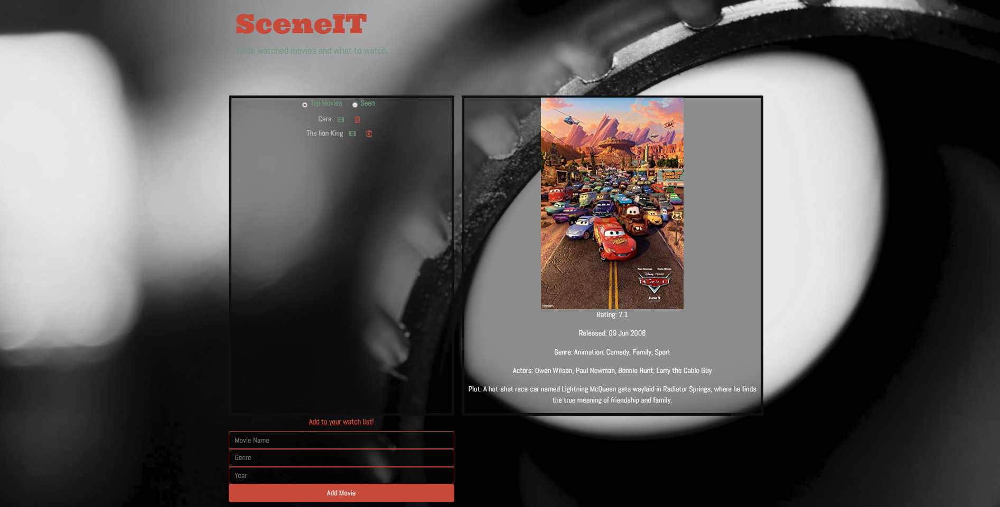

# Project-2

Hosted on Heroku: https://project2-h.herokuapp.com

## Description

SceneIT
* This app allows users to keep a record of movies that they would like to watch and have already watched.
* Able to search movies from OMDb API.
* Movies will be added to a MySQL database. 
* Movies can be moved from the top movies list to the seen list.

## Screenshots

### SceneIT home page

### Movie Result

## Technologies Used

* `Handlebars`
* `Node`
* `Express`
* `MySQL Database`
* `ORM`
* `Javascript`
* `Bideo.js`
* `OMDb API`
* `Heroku`
* `HTML`
* `CSS`
* `Travis Cl`
